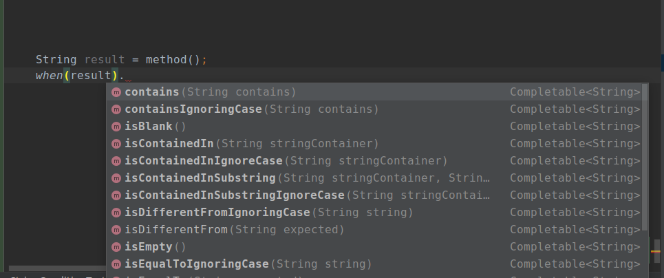

## Very quick start

This guide is for the Wotif core module.

Wotif core Maven package is in its Alpha version and it is only available on github for now. To see how configure Apache Maven for use with GitHub Packages visit [this page.](https://help.github.com/en/packages/using-github-packages-with-your-projects-ecosystem/configuring-apache-maven-for-use-with-github-packages) 

### Get Wotif Core conditions

Add this to your pom.xml:

```markdown
<dependency>
  <groupId>dev.ksarou</groupId>
  <artifactId>wotif-core</artifactId>
  <version>0.0.1-alpha-2</version>
</dependency>
```

Run via command line:

```markdown
mvn install
```

### Add Wotif methods static import

Import all members at once by adding this line to your imports

```markdown
import static dev.ksarou.wotif.core.Conditions.*;
```
Or individually if you prefer

```markdown
import static dev.ksarou.wotif.core.Conditions.when;
import static dev.ksarou.wotif.core.Conditions.whenAllOf;
import static dev.ksarou.wotif.core.Conditions.whenAnyOf;
import static dev.ksarou.wotif.core.Conditions.whenNoneOf;
```

### Use Wotif

Start type `when()` method (or `whenAllOf()`, `whenAnyOf()`, `whenNoneOf()`) and pass it as a parameter the variable you want to test, then type a dot and let your IDE help you choose from the available methods. 



Here an example for a trivial case

```markdown
String result = method();
        when(result).isNotBlank()
                .then(() -> System.out.println("This string is not blank"))
                .orElse(() -> System.out.println("This string is blank"))
                .end();
```

And here another for a non-trivial one

```markdown
when(list_1).contains(stringToFind_1).and(when(list_1).doesNotContains(stringToFind_2))
                .then(() -> {
                    // Instructions...
                })
                .orElse(when(list_2).contains(stringToFind_3).and(when(list_2).doesNotContains(stringToFind_4)), () -> {
                    // Instructions...
                })
                .orElse(() -> {
                    // Instructions...
                }).end();
```

You can also consume the terms you used in your condition, using methods like map or flatMap

```markdown
when(integer).isNegative()
                .map(i -> i * -1)
                .peek(i -> System.out.println(i + " is now positive"))
                .getOrElse(integer);
```
